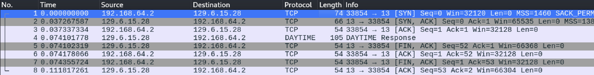

# Wireshark Assignment

**Name**: Palmy Klangsathorn

After examining the list of network frames shown in the main Wireshark display, I identified a total of 8 frames, including the following:

| Frame | Source       | Destination  | Protocol | Packet     |
| ----- | ------------ | ------------ | -------- | ---------- |
| 1     | 192.168.64.2 | 129.6.15.28  | TCP      | [SYN]      |
| 2     | 129.6.15.28  | 192.168.64.2 | TCP      | [SYN, ACK] |
| 3     | 192.168.64.2 | 129.6.15.28  | TCP      | [ACK]      |
| 4     | 129.6.15.28  | 192.168.64.2 | DAYTIME  | Response   |
| 5     | 129.6.15.28  | 192.168.64.2 | TCP      | [FIN, ACK] |
| 6     | 192.168.64.2 | 129.6.15.28  | TCP      | [ACK]      |
| 7     | 192.168.64.2 | 129.6.15.28  | TCP      | [FIN, ACK] |
| 8     | 129.6.15.28  | 192.168.64.2 | TCP      | [ACK]      |

===== DAYTIME =====

**1. Identify the parts of the TCP 3-way handshake by listing the frame summaries of the relevant frames:**

1 192.168.64.2 129.6.15.28 TCP [SYN]  
2 129.6.15.28 192.168.64.2 TCP [SYN, ACK]  
3 192.168.64.2 129.6.15.28 TCP [ACK]

**2. What port number does the client (i.e. nc on your Kali computer) use for this interaction?**

The client uses port 33854.

**3. Why does the client need a port?**

The client needs a port to establish a unique communication endpoint. This port allows the client to receive responses from the server and maintain a separate channel for each communication session.

**4. What frame contains the actual date and time? (Show the frame summary as in question 1 above.)**

4 129.6.15.28 192.168.64.2 DAYTIME Response

**5. What do [SYN] and [ACK] mean?**

- **[SYN]**: Synchronize is used to initiate the TCP connection. It indicates that a client wants to start a communication session with the server.
- **[ACK]**: Acknowledge is used to confirm the receipt of a previous packet.

**6. Which entity (the nc client or the daytime server) initiated the closing of the TCP connection? How can you tell?**

The **daytime server** initiated the closing of the TCP connection. This is evident from Frame 5:
5 129.6.15.28 192.168.64.2 TCP [FIN, ACK]. The connection is going out from port 13 to 33854, the nc IP address to the NIST time IP address. The server sends a `FIN` (finish) flag to indicate that it wants to close the connection.

===== HTTP =====

**1. How many TCP connections were opened? How can you tell?**

There were three TCP connections established: one for sending the HTTP request to retrieve the text content of the page, and two others for loading the images. This is indicated by three different outgoing ports from Kali, all connecting to port 80.

**2. Can you tell where my homepage (index.html) was requested?**

Yes, a TCP connection was established from port 55322 to port 80, where an HTTP request was made, and the HTML content was received in response.

**3. Can you tell where my photograph (jeff-square-colorado.jpg) was requested?**

Yes, the photograph (jeff-square-colorado.jpg) was requested. The request can be identified by looking for the corresponding HTTP GET request in the frame summary. The same port, 55322, was used to request the image to port 80 and received several packets in return containing bytes of the image.
